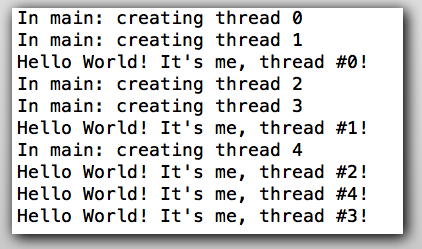

# C / C++ Programming Class 4

---
# Advanced C Language Features for Complex Data Structures and Dynamic Code Execution
## Objectives
- **Master use of Structures and Unions**
- **Use dynamic memory allocation**
- **Use Nested Data Structures**
- **Solve problems using Recursion**
- **Explore support for threads and parallel processing**

---
# Structures
### C Structures provide a convenient way to group related data together in a single "object":
```c
typedef struct my_object_tag {
    char ObjectName [NAME_LENGTH];
    int  Height;
    int  Width;
    int  Length;
} sMyObject;
```
### C allows structures to be initialized conveniently:
```c
sMyObject Car = {"Highlander", 104, 154, 248};
```
### Another example set of data and initialization
```c
typedef struct my_animal_tag {
    char AnimalType [NAME_LENGTH];
    char AnimalName [NAME_LENGTH];
    int  BirthDate;
    int  Weight;
    int  Length;
} sMyAnimal;

sMyAnimal Dog = {"Lab", "Superdog", 20070425, 90, 86};
```

---
# Structures and Unions
### C Unions allow multiple structures to be exclusively included as "objects" in a larger containing object:
```c
typedef struct my_stuff_tag {
    char type;
    union my_ustuff_tag {
        sMyObject sObject;
        sMyAnimal sAnimal;
    } uMyStuff;
} sMyStuff;
```
### C allows structures to be initialized conveniently:
```c
sMyStuff Dog = {TYPE_ANIMAL, .uMyStuff.sAnimal={"Lab", "Superdog", 20120425, 90, 86} };
```

<script src="//repl.it/embed/JPVR/2.js"></script>

### Lets play with structures in Xcode using the cpt3 project.

---
# Dynamic Memory Allocation
### C provides heap memory allocation of arbitrary size in bytes, typically in increments of 4 bytes.  Heap memory may contain linked list info as well as headers and footers to detect errors:
```c
// Create a 100 element array of doubles initialized to zero.
double * pNumbers = calloc ( 100, sizeof(double) );
 
// Create a 99 element array of bytes not initialized to zero.
char * pString = malloc ( 99 );

free ( pNumbers );
free ( pString );
```
### Malloc() does not clear the contents that were previously stored there.  Calloc() clears all bytes in the allocated array to zero.

### Heap memory allocation divides the heap into various size chunks. When blocks are freed, they maybe surrounded by allocated blocks leaving holes in the heap too small for other allocations.  This is called fragmentation and can cause a program to run out of RAM.  Some memory allocators attempt to coalesce neighboring free blocks to reduce fragmentation.  Some programs and programming languages actually stop execution and "garbage collect" free blocks and compact the heap back into a contiguous set of blocks with no holes.  This takes time and can cause programs to pause execution.

<script src="//repl.it/embed/JPWb/1.js"></script>

### Lets play with dynamic memory allocation in Xcode using the cpt3 project.

---
# Advanced Linked and Nested Data Structures
### Pointers used in a doubly linked list provide the ability in add to the end or beginning of the list instantaneously, as well as insert or delete items anywhere in the list without moving items around, by swapping a few pointers:
```c
typedef struct my_stuff_tag {
    struct my_stuff_tag * pNextStuff;
    struct my_stuff_tag * pPreviousStuff;
    char type;
    union my_ustuff_tag {
        sMyObject sObject;
        sMyAnimal sAnimal;
    } uMyStuff;
} sMyStuff;
```

<script src="//repl.it/embed/JPX5/1.js"></script>

### Lets play with these in Xcode using the cpt3 project.

---
# Recursion
### C supports recursion with excellent performance.  Care must be used to avoid excessive stack usage with large numbers of parameters and too deep recursion:
```c
void tower_of_hanoi(int limit, char source, char temp, char dest) {
  if (limit == 1) {
    printf("Move Disk %d From %c To %c\n", limit, source, dest);
    return;
  } 
  tower_of_hanoi (limit - 1, source, dest, temp);
  printf ("Move Disk %d From %c To %c\n", limit, source, dest);
  tower_of_hanoi (limit - 1, temp, source, dest);
}
```

<script src="//repl.it/embed/JP50/1.js"></script>

---
# Threads
### Multiple threads and processes are built into modern CPU's and operating systems.  C language access to threads is usually platform specific, but the popular pthread.h library is commonly used on Linux and OS/X

```c
/******************************************************************************
* FILE: hello.c
* DESCRIPTION:
*   A "hello world" Pthreads program.  Demonstrates thread creation and
*   termination.
* AUTHOR: Blaise Barney
* LAST REVISED: 08/09/11
******************************************************************************/
#include <pthread.h>
#include <stdio.h>
#include <stdlib.h>
#define NUM_THREADS	5

void *PrintHello(void *threadid)
{
   long tid;
   tid = (long)threadid;
   printf("Hello World! It's me, thread #%ld!\n", tid);
   pthread_exit(NULL);
}

int main(int argc, char *argv[])
{
   pthread_t threads[NUM_THREADS];
   int rc;
   long t;
   for(t=0;t<NUM_THREADS;t++){
     printf("In main: creating thread %ld\n", t);
     rc = pthread_create(&threads[t], NULL, PrintHello, (void *)t);
     if (rc){
       printf("ERROR; return code from pthread_create() is %d\n", rc);
       exit(-1);
       }
     }

   /* Last thing that main() should do */
   pthread_exit(NULL);
}
```


### Additional special functions allow processes to be created and even a preferential core specified on multi-core CPU's (which are now standard).

---
